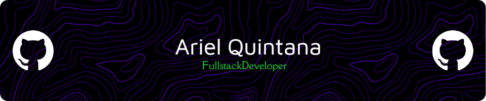

# FullStack Developer  
🔧 Full‑Stack Developer | AI & Automation Enthusiast

---

## 🚀 About Me
I craft real‑world solutions through clean code, cross‑platform development, and smart automation.  
My main toolkit includes building robust web apps, mobile applications, and AI integrations.

---

## 💻 **Tech Stack**

### 🌐 **Web Development**
- **T3 Stack**:  
   - **TypeScript** for type‑safe full‑stack development  
   - **Next.js** for server‑side rendering and API routes  
   - **tRPC** for end‑to‑end typesafe APIs  
   - **Prisma** for modern database access  
   - **Tailwind CSS** for clean, scalable UI design

### 📱 **Mobile Apps**
- **React Native**, **Flutter** for cross‑platform mobile development.

### 🤖 **AI / Automation**
- **Python**: Neural networks, data processing  
- **N8N**: Workflow automation  
- **Vapi**: AI phone calls, virtual operators, and assistants  
- **Rust**, **C++**, **Java** for system‑level or desktop applications.

---

## 🌟 **Featured Projects**

### 🔹 [Vrakka](https://www.vrakka.app)
Wellness mobile app combining habit tracking with tokenized incentives.  

### 🔹 [Debor.ai](https://www.producthunt.com/products/debor-ai)
AI-powered platform for transcribing and semantically analyzing legal cases.

### 🔹 [Networking](https://networking-web.vercel.app/)
Social network to connect professionals and expand opportunities.  

### 🔹 N8N & Vapi Integrations
Custom AI workflows for real‑time process automation, including voice assistants with AI .

---

## ⚡ **What I Do Best**
✅ Build scalable, maintainable web & mobile applications  
✅ Automate real‑world problems with AI workflows  
✅ Innovate by combining diverse stacks into practical solutions

---
## 📫 Connect with Me  
[LinkedIn](https://www.linkedin.com/in/tu-linkedin](https://www.linkedin.com/in/oscararielquintanamerino/))  

